<div align="center">

<!-- MATRIX RAIN BANNER - This SVG file must be in your repo -->



</div>

---

## 🖥️ `> whoami`

```python
class TheOne:
    def __init__(self):
        self.name = "Kim Kutrovacz"
        self.role = "DevOps Engineer in Training"
        self.school = "312 School — Batch 25c"
        self.location = "Chicago, IL"
        self.mission = "Automate everything. Break nothing. Learn daily."
        self.skills = {
            "cloud":       "AWS (EC2, IAM, RDS, S3, VPC, CloudWatch, Lambda)",
            "iac":         "Terraform (Modules, State, Variables)",
            "scripting":   "Python, Bash",
            "version_ctrl": "Git, GitHub, GitHub Actions",
            "os":          "Linux System Administration",
            "ci_cd":       "GitHub Actions, Pipelines"
        }

    def take_the_red_pill(self):
        return "I'm learning how deep the DevOps rabbit hole goes..."
```

---

## 🛠️ `> cat /etc/arsenal`

<div align="center">


</div>

---

## 📊 `> git log --stats`

<div align="center">


</div>

---

## 🌱 `> ./training_program.sh`

```bash
#!/bin/bash
# Kim's DevOps Training — The Matrix Simulation

echo "Initiating training program..."
echo ""

MODULES=(
  "[■■■■■■■■■■] ☁️  AWS Cloud Services"
  "[■■■■■■■■░░] 🏗️  Terraform IaC"
  "[■■■■■■■░░░] 🐍  Python Scripting"
  "[■■■■■■■■■░] 🔀  Git & GitHub"
  "[■■■■■■■■░░] 🐧  Linux Admin"
  "[■■■■■░░░░░] 🔄  CI/CD Pipelines"
  "[■■■■░░░░░░] 🐳  Docker & Containers"
)

for module in "${MODULES[@]}"; do
  echo "  $module"
done

echo ""
echo "  STATUS: I know kung fu. 🥋"
```

---

## 📫 `> cat /etc/contact`

<div align="center">

[](https://github.com/kim081890)
[](https://linkedin.com/in/yourprofile)

</div>

---

<div align="center">

```
"There is no spoon." — The Matrix (1999)
```


</div>
